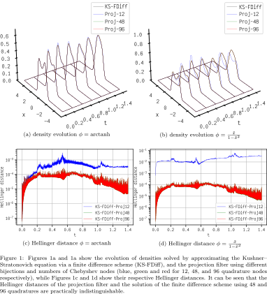

# Projection filter via Automatic Differentiations and Sparse Grid Integration
This repository contains code implementations for methodology presented in _Multidimensional Projection Filters 
via Automatic Differentiation and Sparse-Grid Integration_. 
Links:
1. [arxiv](https://arxiv.org/abs/2112.10594) 
2. [Signal Processing](https://doi.org/10.1016/j.sigpro.2022.108832).

In this repository, we present an implementation of projection filter for an exponential family 
using polynomial expansion, sparse-grid integration and auto differentiation (JaX).

The examples form the paper can be found in Example folder.

## Numerical Simulations as in the paper

All numerical simulations in this section are implemented using [JaX](https://github.com/google/jax) where the automatic differentiation is supported by default. The sparse-grid implementation is taken from the [TASMANIAN](https://github.com/ORNL/TASMANIAN) library. 

### 1 Unidimensional example

The first example is the following scalar system dynamic with a nonlinear measurement model:
$$
    \begin{aligned}
        dx_t &=  \sigma dW_t,\\
        dy_t &=  \beta x^3_t dt +  dV_t,
    \end{aligned}            
$$
with independent standard Brownian motions $\{ W_t , t \geq 0\}$  and  $\{ V_t , t \geq 0\}$, and where $\sigma=0.4, \beta = 0.8$ are constants. We generate one measurement trajectory realization from the model with $x_0 = 1$. The simulation time step is set to be $10^{-4}$. 

We use the exponential manifold with $c_i \in \{x, x^2, x^3, x^4\}$ and choose the initial condition to be $\theta_0 = [0,1,0,-1]$. We assume that this initial condition is exactly the initial density of the dynamical system which corresponds to a double-mode non-Gaussian density with peaks at $-1$ and $1$.

### 2 Two-dimensional example
#### 2.1 Comparison to Kalman--Bucy filter
In this experiment, we consider the following stochastic estimation problem on a two-dimensional linear system:
$$
\begin{aligned}
    d\begin{bmatrix}
    x_{1,t}\\ x_{2,t}
    \end{bmatrix} &= 
    -\begin{bmatrix}x_{1,t}\\ x_{2,t}\end{bmatrix} dt + 
    \sigma_w \begin{bmatrix}dW_{1,t}\\ dW_{2,t}\end{bmatrix},\\
    d\begin{bmatrix}y_{1,t}\\ y_{2,t}\end{bmatrix} &= -\begin{bmatrix}x_{1,t}\\ x_{2,t}\end{bmatrix} dt + \sigma_v \begin{bmatrix}dV_{1,t}\\ dV_{2,t}\end{bmatrix}.
\end{aligned}    
$$

We set $dt=10^{-3}$, $\sigma_v=10^{-1}$, and $\sigma_w=1$a, and simulate the SDE with $n_t=1000$ Euler--Maruyama steps and record the measurement trajectory. To obtain a reference result, we implement the Kalman--Bucy filter using the Euler scheme. For the projection filter, we compare the two integration procedures:  the sparse-grid methods and the quasi Monte Carlo (qMC). We choose the $\text{arctanh}$ function as the bijection function based on our previous examination on the unidimensional problem. We use the Gauss--Patterson scheme for unidimensional sparse grid where we compare various integration levels. For the qMC, we choose the Halton low discrepancy sequence. The number of quadrature points for qMC is chosen to be equal to the selected sparse grid quadrature points.
We use the Gaussian family in our projection filter. This means that we set the natural statistics to be $\{ x^{\mathbf{i}} \}$, where $\mathbf{i} \in \{ (0,1),(0,2),(1,0),(1,1),(2,0) \}$.

#### 2.2 Van der Pol oscillator

In this section, we compare the projection filter, the numerical solution of the Kushner--Stratonovich equation obtained via a Crank--Nicolson scheme, and a bootstrap particle filter with systematic resampling \citep{Chopin2020}. The filtering model considered is the partially observed the Van der Pol oscillator:
$$
    \begin{aligned}
        d\begin{bmatrix}x_{1,t}\\ x_{2,t}\end{bmatrix} &= \begin{bmatrix}x_{2,t}\\ \mu (1 - x_{1,t}^2)x_{2,t} - x_{1,t}\end{bmatrix} dt + \begin{bmatrix}0\\ \sigma_w\end{bmatrix} dW_t,\\
        dY &= x_{1,t} dt + \sigma_v dV_t.
    \end{aligned}
$$
For simulation, we set $\mu = 0.3$ and $\sigma_v=\sigma_w = 1$. We also set $dt=2.5\times 10^{-4}$. We discretize the dynamic model \eqref{eqs:SDE_VDP_n_d_linear} using the Euler--Maruyama scheme for both the particle filter and the simulation. For the particle filter, we use $4\times 10^4$ samples at each time. The time step of the finite-difference scheme is set to be $dt=1\times 10^{-3}$. The two-dimensional grid is set to be $(-6,6)^2$ with $150^2$ equidistant points. In the projection filter we use a sparse-grid integration scheme where we set the level to 8, which corresponds to 4097 quadrature points, and we set the bijection to $\text{arctanh}$.   
The natural statistics in the projection filter are set to be $\{ x^{\mathbf{i}} \}$, where $\mathbf{i} \in \{ (0,1),(0,2),(0,3),(0,4),(1,0),(1,1),(1,2),(1,3),(2,0),(2,1),(2,2),(3,0),(3,1),(4,0) \}$. Further, the initial density is set to be a Gaussian density, with variance equal to $5\times 10^1 \sigma_w^2 dt I$ and mean at the origin.

